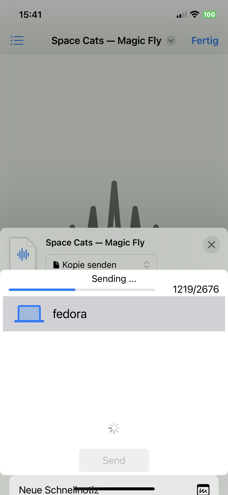

# SwiftDrop for iOS   

iOS App providing [SwiftDrop](https://github.com/theswiftfox/swiftDrop) functionality via the share menu.  
It discovers devices advertising the swiftDrop bluetooth service and after selecting one opens an L2CAP channel with the target device for sending.  

    

## In Action
The app is invoked form the share menu and shows the devices it discovered with the swift drop service.  
During sending a progress bar and label is visible to provide feedback about the ongoing transfers.    
<!-- 
 -->

<!-- 
 -->

## Planned 
- allow receiving of files  
- improve transfers speed  
- better UI maybe